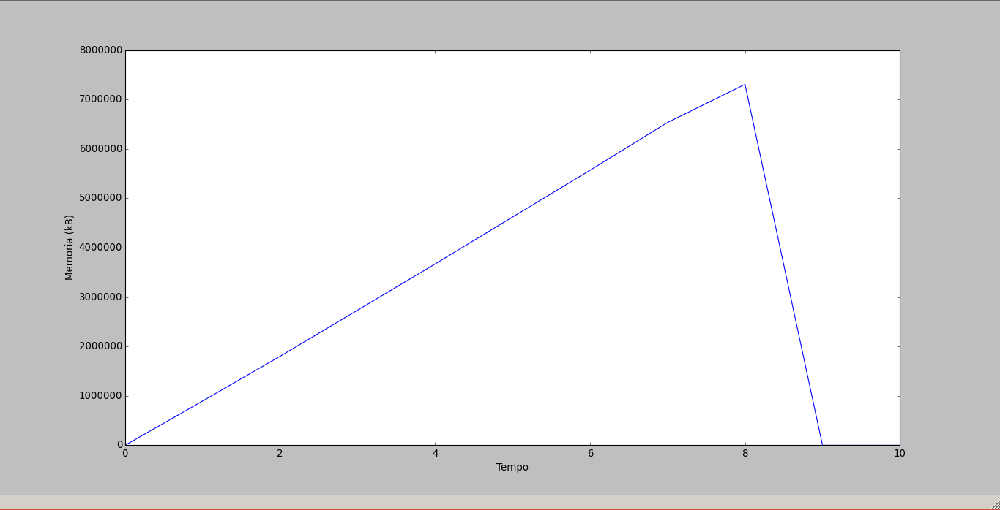

# Identificação

* Página do repositório do trabalho ([link GitHub](https://github.com/marinalimeira/2015.1-IAC-trabalho-pratico))

* Discente 1
	* Nome: Marina Francino Lessa Neto Limeira
	* Matrícula: 15111985
* Discente 2
	* Nome: Júlia Albuquerque Aguiar
	* Matrícula: 15111948

#Fundamentação Teórica

Os processos podem ser resumidamente definidos como programas em execução. É o conjunto de recursos (áreas de memória, uso do processador, conexões de rede e etc) utilizados pela tarefa para sua execução e monitoramento no sistema operacional, ou seja, os processos nos oferecem dados sobre o estado dinâmico de aplicação de uma sequência de instruções definidas por um programa específico.
No sistema UNIX, os processos são criados através do comando “fork”, que é uma chamada de sistema. Uma System Call (ou chamada de sistema) é a forma como um programa gera um requisito ao sistema operacional, sendo assim, o fork tem como função fazer uma requisição para criar um novo processo que seria uma réplica do processo solicitante – comumente chamado de processo filho e processo pai, respectivamente. 
Ao ser criado o processo filho, ele passa a ter os mesmos recursos do pai, embora sejam armazenados em locais de memórias diferentes. Ambos os processos agora serão executados quase em paralelo, ainda assim havendo uma hierarquia pela qual o processo pai pode monitorar o processo filho, assim nasceu a razão do presente trabalho. Que como pode ser visto no arquivo ```main.c``` tem como objetivo criar e monitorar a utilização de recursos do sistema. Esse código foi desenvolvido e executado para experimentação e análise na gestão de processos, especificamente na utilização da UCP e da memória. E os resultados obtidos estão descritos na próxima seção.

# Discussão

## Utilização intensa da UCP

Para utilização intensa da UCP, foi executado o seguinte código no processo filho:

```c
for (;;) {}

```

Podemos observar que a função utilizada desta forma gera um loop infinito que impede que outros processos interrompam o que está sendo executado. Quando o programa foi testado com a entrada ```cpu```, os seguintes resultados foram encontrados:


Os gráficos foram gerados no mesmo contexto do algoritmo escrito que monitora a utilização da UCP a cada segundo pelo processo, controlada pela função ```clock()``` que determina o intervalo de consulta. Sendo assim, o gráfico demonstra o uso da UCP medida a cada segundo durante dez segundos. No instante zero, o processo é recém-criado e portanto ainda se encontra em espera para execução que acontece no próximo segundo. Como garantido anteriormente pelo código ```for (;;;) {}```  a utilização de UCP pelo processo é máxima, sendo os 25% mostrado no gráfico a representação disso – observando que arquitetura do computador usado para experimentação contém  quatro núcleos e que cada núcleo é utilizado por vez, explica-se os 25% como um quarto do sistema de processamento total da máquina. Já a utilização da memória é constante, pois não foi feita alocação dinâmica no programa.


## Utilização intensa da UCP e memória

Para utilização intensa da UCP e memória, foi executado o seguinte código no processo filho:

```c
for (;;) {
    malloc(sizeof(1));
}
```

Como na outra função, essa também gera um loop infinito. Além disso, ela aloca a cada loop 4 bits, gerando um uso de memória escalável e intensa a cada instante. Por conta do rápido aumento no uso da memória, durante o desenvolvimento e experimentação do código, houve complicações com o sistema. O que foi resolvido com uma mudança no valor passado a função ```malloc()``` para um número menor que ainda ao final da execução não alocasse toda a memória causando travamento do sistema. Os seguintes gráficos foram gerados com a entrada ```cpu-mem``` na experimentação:



O comportamento do uso de memória é representa por uma reta crescente, devido a alocação a cada loop ser feita com o mesmo tamanho de espaço de memória. O uso de UCP apresenta um comportamento crescente no início, mas prossegue inconsistente depois de determinado tempo, representando as interrupções de outros processos requisitando o uso do processador. 


